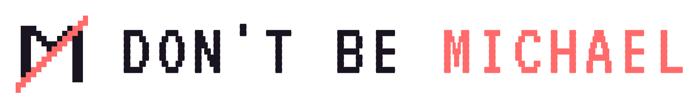

<div align="center">

<picture>
  <source media="(prefers-color-scheme: dark)" srcset="./branding/logo/lockup/dbm-lockup-horizontal-dark.svg">
  
</picture>

### An AI office for your small business

**[dontbemichael.com](https://dontbemichael.com)**


Pick your kind of business, pick your team, and Michael, your office manager, runs the floor
while you run the business. Every team member is an AI agent with a job, its own folder and its
own memory, working on your Mac.

<p>
  <a href="./LICENSE"></a>
  
  
  <a href="https://dontbemichael.com"></a>
</p>

<br>

<!-- Inline player renders on github.com (raw URL required; relative paths only link). -->
<video src="https://github.com/agentvivekkumar/dontbemichael/raw/main/docs/media/hero.mp4" controls muted loop playsinline width="820">
  <a href="https://github.com/agentvivekkumar/dontbemichael/raw/main/docs/media/hero.mp4">▶ Watch the office at work</a>
</video>

<br><br>

**[Download for Mac](https://github.com/agentvivekkumar/dontbemichael/releases/latest)**

</div>

---

> [!NOTE]
> **Brief Michael. Let the office do the rest.**
> Tell Michael what you need. He hands the work to whoever's job it is, keeps the team moving, and
> brings you only the calls that need you.

## Contents

- [What it is](#what-it-is)
- [Your team](#your-team)
- [What the office does](#what-the-office-does)
- [Getting started](#getting-started)
- [Your data](#your-data)
- [For developers](#for-developers)
- [Contributing](#contributing)
- [License](#license)
- [Acknowledgements](#acknowledgements)

## What it is

Don't Be Michael is a desktop app that runs a small office of AI team members for your business.
Each team member is a [Claude Code](https://claude.com/claude-code) agent with a role: finance,
customer support, sales, marketing and so on. Michael is the office manager. You talk to him; he
routes the work, answers the team's questions, and asks you only when something needs your
decision.

Everything runs on your Mac, on the Claude plan you already have. Each team member shows up as a
character on a pixel office floor, so you can see who is working on what.

## Your team

Setup asks for your business and your kind of business, then suggests a team from that business's
Office Pack. You pick who joins, and you can hire more later.

| Kind of business | Suggested team |
|---|---|
| Restaurant & Food | Finance, Executive Admin, Customer Support, Marketing, Quality Control, Supply Chain, HR Manager |
| Retail Shop | Finance, Executive Admin, Customer Support, Inventory & Shipping, Marketing, Supply Chain, Sales Director |
| Pro Services | Finance, Executive Admin, Customer Support, Sales Director, Marketing, IT Security |
| Home Services | Finance, Executive Admin, Customer Support, Sales Director, Inventory & Shipping, Supply Chain, Marketing |
| SaaS/Consulting | Finance, Executive Admin, HR Manager, Customer Support, Sales Director, Marketing, IT Engineer, IT Security |
| Something else | Pick from the core roles |

Each role comes with a Role description, which tells Michael what work to send there, and a Work
style, which tells the team member how to do its job at your business. You can change both in
Edit Agent.

## What the office does

<table>
<tr>
<td width="50%" valign="middle">

### Talk to Michael, not the whole team

Michael is the one you brief. He sends each job to the team member whose role fits, keeps an eye
on the task board, and brings you only what needs you. Once an hour he runs a standup with the
team. He is the only one who sends you desktop notifications. To speak with one team member
directly, open it and choose **Talk 1:1**; Michael sends it no work until you end the 1:1.

</td>
<td width="50%">
  <a href="https://github.com/agentvivekkumar/dontbemichael/raw/main/docs/media/demo/orchestrator.mp4"></a>
</td>
</tr>
<tr>
<td width="50%" valign="middle">

### Hire a team member

Give a new hire a name, a role, a Role description and a Work style. It gets its own folder inside
your business folder and starts working.

</td>
<td width="50%">
  
</td>
</tr>
<tr>
<td width="50%" valign="middle">

### Memory that improves

Each team member keeps a short list of lasting notes: your preferences and corrections, facts it
looked up, where things live, and the steps for tasks it does again. A tidy up in the background
merges and updates them, so memory gets better instead of piling up.

</td>
<td width="50%">
  
</td>
</tr>
<tr>
<td width="50%" valign="middle">

### You stay in charge

Spending money, deleting things and changes of scope come to you. A team member that loops or
keeps failing is steered, then held, then stopped. Each one works under house rules: state only
what it can trace to a source, say when it doesn't know, and never make up people, customers or
quotes.

</td>
<td width="50%">
  
</td>
</tr>
<tr>
<td width="50%" valign="middle">

### Watch the office work

Team members walk to their stations as they work, and envelopes fly between desks when they
message each other. Click any desk to see that team member's work live.

</td>
<td width="50%">
  <a href="https://github.com/agentvivekkumar/dontbemichael/raw/main/docs/media/demo/agents.mp4"></a>
</td>
</tr>
<tr>
<td width="50%" valign="middle">

### Set up once

Setup asks for your business name, where you are and your kind of business, then suggests a
team. It checks what your Mac already has and offers to install anything missing.

</td>
<td width="50%">
  <a href="https://github.com/agentvivekkumar/dontbemichael/raw/main/docs/media/demo/setup.mp4"></a>
</td>
</tr>
</table>

**Running the office**
- **Ask me.** When the team needs a decision, it goes on Michael's Ask me board. Your answer goes back to whoever asked, and they remember it.
- **Schedules.** Each team member has a Schedules tab for its own jobs. Say when and which job ("Follow up on unpaid invoices", every weekday at 9), and the team member does it the way its Work style says. A team member can ask for a schedule change, but nothing changes until you approve it in Ask me.
- **Every team member's panel.** Profile first (the job, its folder and the instructions it works from), then Messages as a day by day history, Schedules, and Memory as readable notes.
- **Tasks and the floor.** A switch in the corner of the floor shows the animated office, the whole task board, or who talks to whom.
- **Slack and webhooks.** Message a Slack channel or send a webhook, and Michael picks it up and replies in the thread.
- **A fresh start without losing work.** A team member that has sat idle with a long conversation writes a handoff of anything unfinished, then starts fresh. You can bring the old conversation back.

**Your business, known to everyone**
- **Company profile.** Your business name, owner, address, hours, time zone, currency and more, given to every team member. Change it in Settings.
- **Company knowledge.** Add your documents and policies in Memory & Knowledge: Word, Excel, PowerPoint, PDF, and scans or photos. Every team member can search them by words, and by meaning when MemPalace is installed, so "money back" finds your refund policy.

**Private folders**
- Michael works in your business folder, and each team member works in its own folder inside it.
- A team member opens only its own folder. Michael can read his team's folders but not change them. Claude Code's sandbox and the app both enforce this.

**Also**
- **Updates.** The app tells you when a new version is out and links to the download.
- **Your language.** English, Simplified Chinese and Arabic, with right to left layout for Arabic.

<div align="right">(<a href="#what-it-is">↑ back to top</a>)</div>

## Getting started

### What you need

- A Mac with Apple Silicon or Intel.
- [Claude Code](https://claude.com/claude-code), signed in to your Claude plan. A Claude Max plan
  keeps the office running all day; smaller plans reach their usage limit during the day, and the
  office waits until it resets. The app can install Claude Code for you from
  **Settings → Prerequisites**.

### Install

1. Download the `.dmg` from the [latest release](https://github.com/agentvivekkumar/dontbemichael/releases/latest).
2. Open it and drag **Don't Be Michael** into your Applications folder.
3. Open it from Applications. The first time, macOS says it could not verify the app. Click
   **Done**, then open **System Settings → Privacy & Security**, scroll to the message about Don't
   Be Michael and click **Open Anyway**.

You only do step 3 once. macOS asks because this early build is not yet signed with an Apple
Developer ID. Setup takes it from there.

Windows and Linux will follow.

## Your data

- **It stays on your Mac.** Your team's work, memory and files live in folders on your Mac. The
  team members themselves run through your own Claude Code and Claude plan.
- **No usage data.** The app sends nothing about how you use it. See [`TELEMETRY.md`](./TELEMETRY.md).

## For developers

Don't Be Michael is an Electron app (React, TypeScript, Pixi.js, xterm.js, node-pty). Each team
member is a real Claude Code process in its own terminal. The team coordinates through the hive,
a folder of plain files with a mailbox, memory and a task board per agent; only the app commits to
it.

### Build from source

You need Node.js 18 or newer, npm, and a C/C++ toolchain for `node-pty` (on a Mac:
`xcode-select --install`).

```bash
git clone https://github.com/agentvivekkumar/dontbemichael.git
cd dontbemichael
npm install        # also rebuilds node-pty for Electron
npm run dev        # the app with hot reload
```

```bash
npm run typecheck     # main, preload and renderer
npm run test:focused  # the node:test suite in test/
npm run build         # production build
npm run dist:mac      # the Mac installer, in dist/
```

If `node-pty` fails to load after an Electron upgrade, run `npm install` again.

### Where to read next

- [`docs/ARCHITECTURE.md`](./docs/ARCHITECTURE.md): diagrams and the module map.
- [`HIVE.md`](./HIVE.md): how agents coordinate.
- [`SPEC.md`](./SPEC.md): the terminal and event planes.
- [`branding/DESIGN.md`](./branding/DESIGN.md): the design system, for any new UI.

### What this build leaves out

Setup offers only Claude Code. The code still carries presets for other agent CLIs (Codex, Gemini,
Grok, Kimi, Qwen, OpenCode, Crush, pi, Copilot and Cursor), your own API keys and local models,
but this build doesn't offer them. Some developer features are switched off because business
owners don't use them: git views, the built in code editor, temporary helper agents, voice, and
opening a Terminal in an agent's folder. Each one has a switch in
[`src/shared/buildFeatures.ts`](./src/shared/buildFeatures.ts).

## Contributing

Contributions are welcome. Start with [`CONTRIBUTING.md`](./CONTRIBUTING.md). Found a bug or have an
idea? [Open an issue](https://github.com/agentvivekkumar/dontbemichael/issues).
[`CONTRIBUTORS.md`](./CONTRIBUTORS.md) lists everyone with a merged pull request. Changes are in
[`CHANGELOG.md`](./CHANGELOG.md).

## License

The **source code** is licensed under the **MIT License**. See [`LICENSE`](./LICENSE). The original
copyright notice of the project this is forked from is kept in `LICENSE`, as the MIT license
requires.

> [!IMPORTANT]
> **Asset licensing.** The bundled pixel art (tilesets and maps) is **Modern Interiors - RPG Tileset
> [16X16]** by [LimeZu](https://limezu.itch.io/moderninteriors), used under the **Complete Version
> licence**, which permits editing and use in commercial and non-commercial projects. **That licence
> requires credit to LimeZu**, and the credit must stay in place. The office cast is not LimeZu art.
> It is drawn procedurally in `portraitArt.ts`. See
> [`src/renderer/src/assets/ATTRIBUTION.md`](./src/renderer/src/assets/ATTRIBUTION.md).

The MIT license covers only the code. The bundled pixel art is licensed separately by LimeZu and is
excluded in [`LICENSE-ASSETS`](./LICENSE-ASSETS). *Don't Be Michael* is not affiliated with NBC,
*The Office*, or Dunder Mifflin.

## Acknowledgements

- [Munder Difflin](https://github.com/chaitanyagiri/munder-difflin) by Chaitanya Giri and its contributors, the open-source project this product is forked from.
- [LimeZu](https://limezu.itch.io/) for the *Modern Interiors* pixel-art tilesets (Complete Version licence).
- [`shahar061/the-office`](https://github.com/shahar061/the-office) for the office tileset and map vendoring.
- [Pixi.js](https://pixijs.com/) · [xterm.js](https://xtermjs.org/) · [node-pty](https://github.com/microsoft/node-pty) · [electron-vite](https://electron-vite.org/) · [CodeMirror](https://codemirror.net/) for the libraries this is built on.
